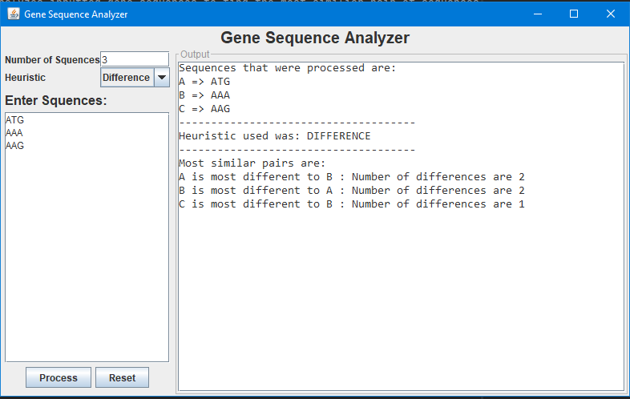

# Gene Sequence Analyzer
- Analyzes inputted gene sequences to find the most similar pair of sequences based on the chosen heuristic.

### Technologies
- The Frontend is build in using Java Swing library.
- The Backend utilizes MVC architecture.

